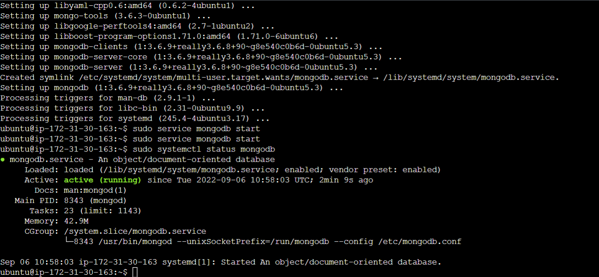

# Project 4 Documentation

#   Updating ubuntu

`sudo apt update`

#   Upgrading ubuntu

`sudo apt upgrade`

#    Adding certificates

`sudo apt -y install curl dirmngr apt-transport-https lsb-release ca-certificates`

#   Installing NodeJS

`sudo apt install -y nodejs`

#   Installing MongoDB

`sudo apt install -y mongodb`

#    Starting The server

`sudo service mongodb start`

#    Verify that the service is up and running

`sudo systemctl status mongodb`

#    Installing npm and Initializing npm project

`sudo apt install -y npm`  `npm init`

#  Installing body-parser package

`sudo npm install body-parser`

#  Creating a folder named ‘Books’ and adding file server.js

`vi server.js`

#   Installing Express and set up routes to the server

`sudo npm install express mongoose`

#   Creating a file named routes.js

`vi routes.js`

#     Creating a file named book.js

`vi book.js`

#    Starting the server

`node server.js`

#     Web Book Register Application

  `http://44.201.193.182:3300`

